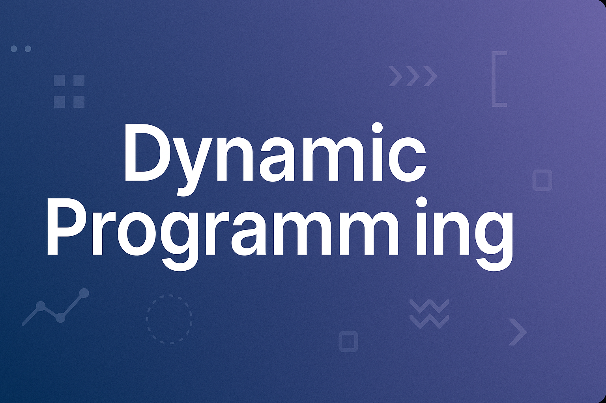

# 🧠 Dynamic Programming

A comprehensive collection of algorithms, explanations, and examples
demonstrating the principles of **Dynamic Programming (DP)** --- an
essential paradigm in computer science for solving complex problems
efficiently.

